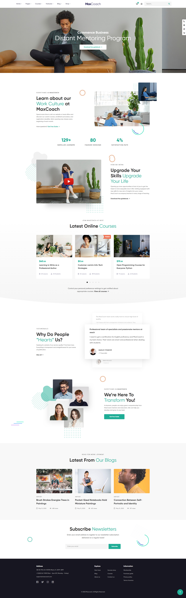

# Mid-Course Project

## Descrizione

Riproduzione della homepage di un sito web utilizzando HTML, CSS, VUE JS, SASS E FONTAWESOME avvalendosi dell'uso di VITE per il template del progetto e la gestione dei vari componenti implementati.
Sotto abbiamo un'immagine del risultato finale ottenuto:

